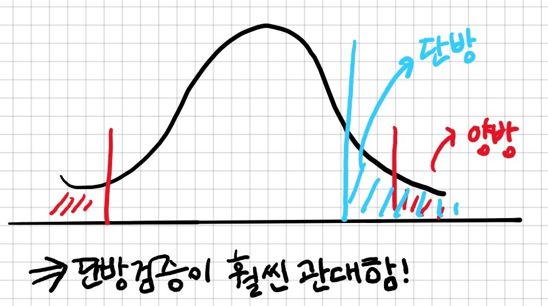

# 5강

강의명: 실험과 설문
일자: Sep 05, 2019
주제: 실험

### # 복습 테스트

1. 같은 모집단에서 샘플링을 하면, 할 때마다 

    `서로 다른 샘플을 얻게 된다.`

2. Sampling distribution란

    `샘플에서 구한 통계치가 샘플마다 어떻게 달라지는지 분포이다`

        #해설
        샘플에서 뽑아낸 샘플들의 통계치를 구할때마다 값들이 달라짐. 그것을 나타내는 분포

3. 평균의 95% 신뢰구간이란 95%의 샘플에서 나올 수 있는 평균의 범위를 가리킨다

    `참`

        #해설
        즉, 평균중에 일정한 범위내에서 나오는 것을 신뢰구간이라 하며 그 중 95%로는 이 범위안에 들어감
        신뢰구간은 필요에 따라 99% 사용해도 됨.

4. 95% 신뢰구간을 구할 때는 보통

    `하위 2.5%와 상위 2.5%를 제외한 범위를 사용한다`

        #해설
        너무 극단적으로 작거나 큰 값을 빼고 함

5. 샘플의 크기가 클 수록 신뢰구간은 

    `좁아진다`

        #해설
        샘플의 크기가 크다는 것은 데이터가 많다는 것이고 그만큼 정확하다는 것으로 좁아짐

6. 의사결정을 내리기 위해서는 신뢰구간은 충분히

    `좁아야 한다`

        #해설
        범위를 좁게 얘기 해줘야 확신을 할 수 있기 때문

7. 선형모형 y=ax+b에서 계수 a의 신뢰구간은

    `마이너스든 플러스든 어느 한 쪽에만 있어야 한다`

        #해설
        a * X 여기서 a는 y와의 관계를 보여주므로 확실하게 한 쪽에만 있어야 함

8. 부트스트래핑은

    `우리가 가진 샘플에서 다시 샘플링(리샘플링)을 반복하는 방법이다.`

        #해설
        모집단에서 샘플링을 반복하는 것은 거의 불가능함

9. 부트스트래핑에서는 우리가 가진 샘플이 모집단을

    `실제로 잘 반영하는지는 알 수 없지만, 잘 반영할 것이라고 가정한다.`

        #해설
        아무도 실제로 잘 반영하는지는 모름. 모집단을 잘 반영하려고 노력할 뿐

10. 부트스트래핑은 샘플에서 리샘플링을 많이 하면

    `신뢰구간을 정확히 알 수 있다.`

        #해설
        딥러닝은 부트스트래핑을 안함. 신뢰구간을 못 구함

11. 사이킷런의 resample 함수를 사용하여 df = resample(cars)와 같이 실행했습니다. 그 결과에 대해 옳은 것을  **모두** 고르세요

    `df와 cars의 크기는 같다
    부트스트래핑을 하여 신뢰구간을 구하려고 한다면 df를 바탕으로 통계치를 구해야 한다`

        #해설
        df와 cars의 크기는 같음.
        데이터 사이즈를 갖게 해줘야 하기 때문

12. numpy.quantiles(ms, .025)는 무엇을 구합니까?

    `하위 2.5%의 위치`

        #해설
        .025는 .025 * 100 = 2.5 이므로 하위 2.5%
        상위 2.5%는 .975 일 경우 

13. 실험을 하고 신뢰구간을 구해봤더니 신뢰구간이 우리가 필요로 하는 범위보다 넓었습니다. 무엇을 해야 합니까?

    `더 많은 실험을 해서 샘플의 크기를 키운다`

        #해설
        신뢰구간은 의사결정을 하기 위해서는 좁아야 하므로, 더많은 실험을 통해 샘플의 크기를 키워야 한다.

### #수업내용

**#실험**

- 실험과 설문 : 실험 설계, 집단 간 비교, 효과 크기, 설문지 만들기

- 상관과 인과
    - 상관(correlation): 두 변수가 함께 움직이는 정도

        → 한쪽에 따라 한쪽도 움직이는 것을 상관이라고 함.

    - 상관은 인과(causation)가 아니다

        ex> 아이스크림 판매량과 범죄 발생건수

        → 위의 예시는 기온과 관련된 것일뿐 인과가 아님.

        → 상관관계가 모호할 경우는 변수를 통제해 보는 것이 좋음

- 실험
    - 인과를 확인하기 위한 개입
    - 조건(condition): 실험자가 체계적으로 변화시키는 독립변수의 각 단계

- 외생 변수 extraneous variables
    - 바깥에 사는 변수라고 해서 실험에서 직접 안건드린 변수를 말함
    - 실험의 독립/종속 변수가 아닌 변수
    - 혼입 변수 confouding variable : 종속 변수에 영향을 미치는 외생 변수
    - 일정 범위로 고정시키거나 통계적으로 통제가 필요함

        ex> 담배와 암발생 (대마, 술은통제되지 않은 외생변수로 암발생에 영향을 끼치므로 일정범위 통제할 필요가 있음)

- 종속변수 고르기
    - 실험의 목적을 고려 (결국은 돈을 벌려는 목적)

            ex> 고객 만족도는 중요한가?
            고객 만족도를 왜 보는가? 
            돈을 직접측정하기 어렵기 때문에 

    - 매개변수(mediator) 사용
        - 독립변수 → 매개변수 → 종속변수

            ex> 넷플릭스에서 고객 이탈률 vs. 사용 시간

### # [실습] 실험의 변수 고르기

- 어떤 실험을 해보고 싶은가?
- 실험의 변수는 무엇이 될까?
    - 독립변수(조건)
    - 외생변수
    - 종속변수(또는 매개변수)

        1. (독립)서비스 개선/유용한 컨텐츠/마케팅 -> 홈페이지 활성화 -> 구매
        #해설 
        조건이 없고, 정확한 고객의 반응을 파악불가
        
        2. 버티컬마우스가 손목 건강에 좋은가
        독립: 버티컬마우스 사용
        외생: 컴퓨터, 스마트폰 사용
        종속: 손목건강
        
        3. 수면의 질이 수업집중도를 높이는가 
        종속 : 수업집중도
        독립 : 수면의 질
        외생 : 전날 음주, 카페인 섭취, 아침식사 등등
        
        #해설
        인과를 확인하기 위한 수면 개입이 불가능한 것
        
        4. 비오는 날 데잇걸즈 출석률
        독립변수 : 시간당 강수량
        외생변수 : 평상시 출결현황
        종속변수(매개변수) : 출석률
        
        #해설 
        강수량을 개입하기 어렵다는 점이 있음. 실제 원인이 비가 아닐 수가 있기 때문에 실험하기 어려움
        
        5. 맥주섭취와 체중증가
        독립: 맥주섭취
        외생: 식습관, 생활습관
        종속: 체중
        
        6. 커피브랜드별 몸의 반응 
        독립: 특정 커피브랜드
        외생: 식습관, 생활
        종속: 수면시간, 두통여부
        
        #해설
        자기자신에 대한 실험은 통제하기 어렵고, 샘플이 작다는 한계가 있음
        
        7. 휴대폰 사용시간에 따른 손목통증 
        독립: 휴대폰사용시간 
        종속: 손목통증
        외생: 일상에서 손목을 사용하는 시간 
        
        8. 
        독립: 면접과정, 팀원, 연봉, ...
        종속: 행복한 회사생활(회사에 가고싶다/아니다)
        
        #해설
        개입할 수 있는 것이 하나도 없기 때문에 실험을 할 수가 없음.

- 실험설계의 종류
    - between-subject : 조건마다 다른 사람을 참여시킨다
        - 흔히 많이 하는 실험 방식 ex> 신약개발
        - 조건마다 참여자를 무작위로 할당하는 것

                무작위할당 random assignment?
                - 완전히 무작위로 할당할 경우 한쪽 조건에 참여자가 몰릴 수 있음
                - 참여자들은 무작위로 섞은 다음 순서대로 조건에 할당할 수 있음
                - 무작위 할당 대신 특정 외생변수가 골고루 섞이도록 할당

        - 이중맹검(double blindness) : 실험 중 어느 참여자가 어느 조건인지 참여자도/실험자도 모르게 하는 것
        - 삼중맹검 : 이중맹검+분석자도 모르게 하는 것

        심슨의 역설 Simpson's Paradox
        →  부분 부분은 패턴이 있지만, 섞어놓으면 패턴이 사라짐
        ex> 대학교 학과

    - within-subject: 같은 사람을 모든 조건에 참여시킨다
        - 한 참여자가 모든 조건에 참여하는 것
        - 외생변수를 거의 완벽히 통제할 수 있음
        - 참여자가 실험 조건을 눈치채고 영향을 받을 수 있음
        - 모든 종류의 실험이 가능한 것은 아님 ex> 신약개발
        - 순서효과 order effect
            - 참여한 조건의 순서가 실험에 영향을 미치는 것
            - 이월효과 carryover : 이전 조건이 후속 조건에 영향
                - 연습효과
                - 피로효과
                - 대조효과

                순서효과는 Within에서 만 나옴

        - Counterbalancing
            - 순서효과를 없애기 위한 목적
            - 조건들의 순서에 균형을 맞추는 것
            - 무작위
            - 라틴 스퀘어 : 마방진? → 순서 자체는 고정이나 무엇을 먼저할 지만 달라짐

            ### # 두 집단의 평균 차이

            ### # 부트스트래핑을 이용한 평균 차이 검증

            Ronald Fisher 와 Muriel Bristol

            ### #단방 검증과 양반 검증

            - 양방 검증: 신뢰 구간을 정할 때 양쪽 극단을 제외하고 정함 → 양쪽 2.5%
            - 단방 검증: 신뢰 구간을 정할 때 한 쪽 극단만 제외

                

             ⇒ 일반적으로는 양방 검증을 많이 함

            ### # 오류의 종류

            - 1종 오류 : 판정을 다르다고 했으나 실제로는 같은 경우
            - 2종 오류: 실제로는 차이가 있는데 검증결과 무시한 경우

                → 1종 오류가 늘면 2종 오류가 줄고, 1종 오류가 줄면 2종 오류가 늘어남

                → 두 오류를 낮추려면 샘플사이즈를 엄청 크게 키워야 함.

            ### # 신뢰 수준과 유의 수준

            - 신뢰 수준  = 100% - 유의 수준(1종 오류의 확률)
            - 신뢰 수준 = 95%이면, 유의 수준 = 5%