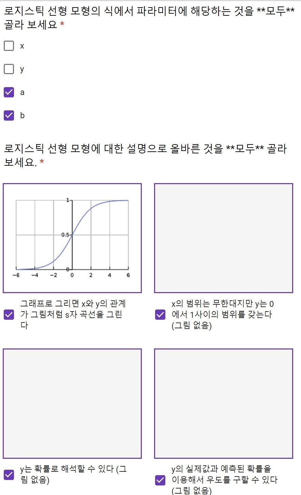
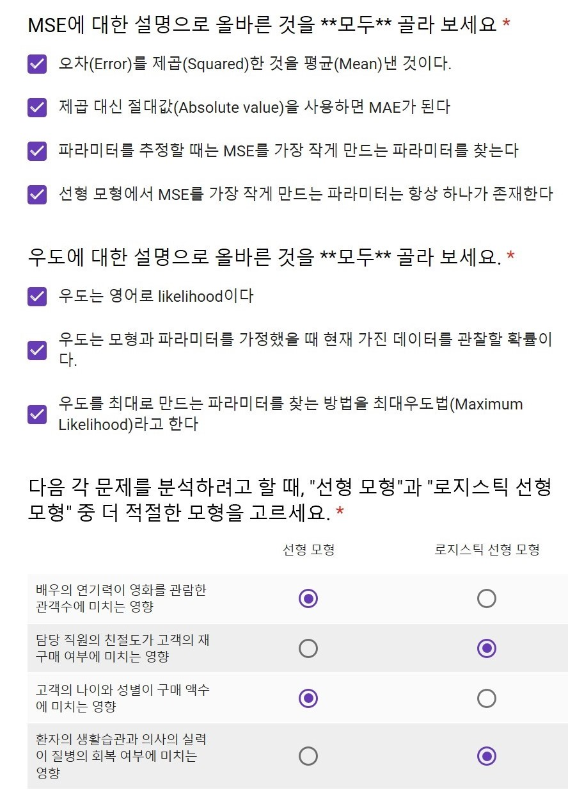
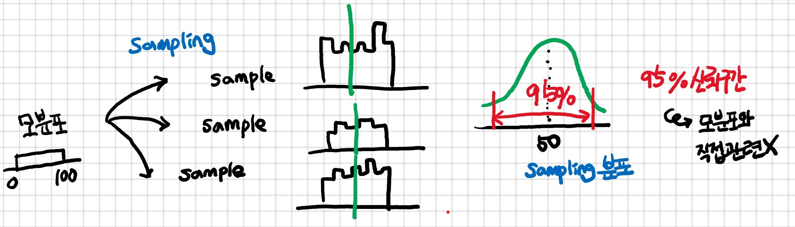
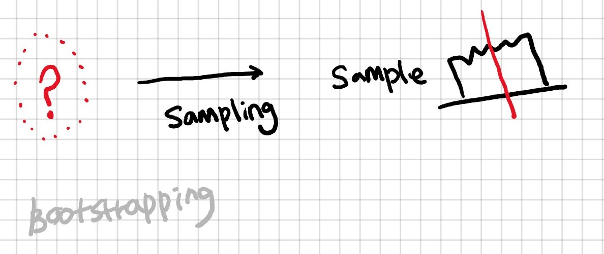
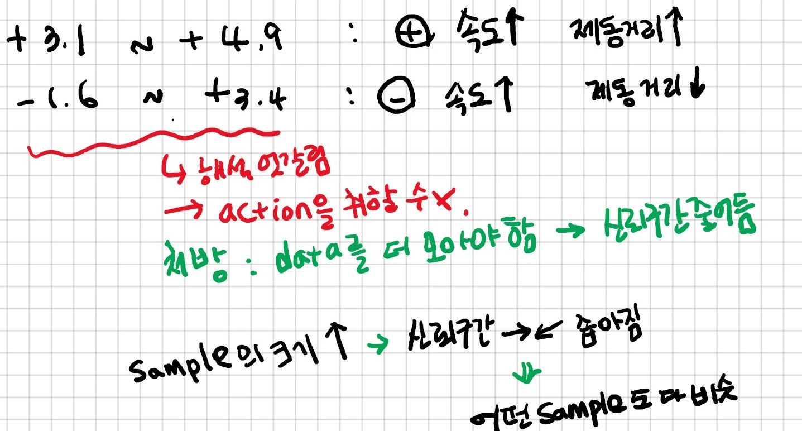
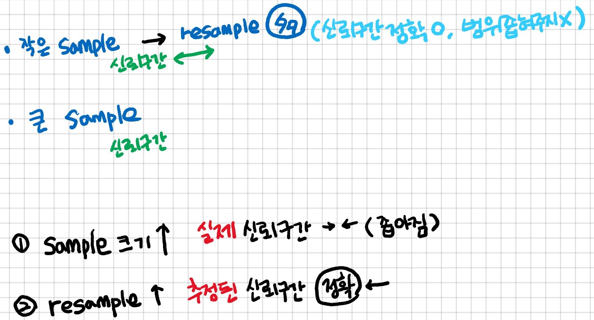

# 4강

강의명: 신뢰구간
일자: Sep 03, 2019
주제: 신뢰구간

### <복습>

### 수업내용

### 4. **신뢰구간 confidence interval**

- 추정치가 데이터에 따라 달라질 때 어디까지 달라지는가를 의미

---

- **표본분포 sampling distribution**
    - 동일한 분포에서 같은 크기의 표본(sample)을 추출
    - 각 표본에서 통계치(ex. 평균, 중간값 등)를 추정
    - 표본분포 : 추정된 통계치의 분포
    - sampling 분포 ≠ sample 분포

---

- **부트스트래핑 bootstrapping**
    - 표본에서 다시 표본을 재추출(resample)하는 방법
    - 표본이 모집단 분포를 잘 반영할 경우
    - 비모수적(non-parametric)

---

- 신뢰구간은 sample size만 영향을 끼치고 전체 모집단은 필요없음

    

    

- **과적합 overfitting**
    - 현재 가진 표본에 지나치게 치우친 추정을 하는 것
    - 실제 분포와 거리가 있어 예측력이 떨어짐
    - 신뢰구간이 굉장히 넓어지게 되고, 샘플마다 다 다른 소리를 하기 때문에 모집단과도 다를 가능성이 커짐

- **교차검증 cross validation**
    - 현재 데이터를 training set와 test set으로 무작위 분할
    - training set으로 추정
    - test set으로 테스트
    - 과적합이 있을 경우 training set에 비해 test set의 예측이 떨어짐

- **정규화 regularization**
    - 과적합을 방지하는 방법들
    - 과도한 추정치에 패널티를 부과 (수학적 트릭을 사용)
    - 추정을 조기에 중단