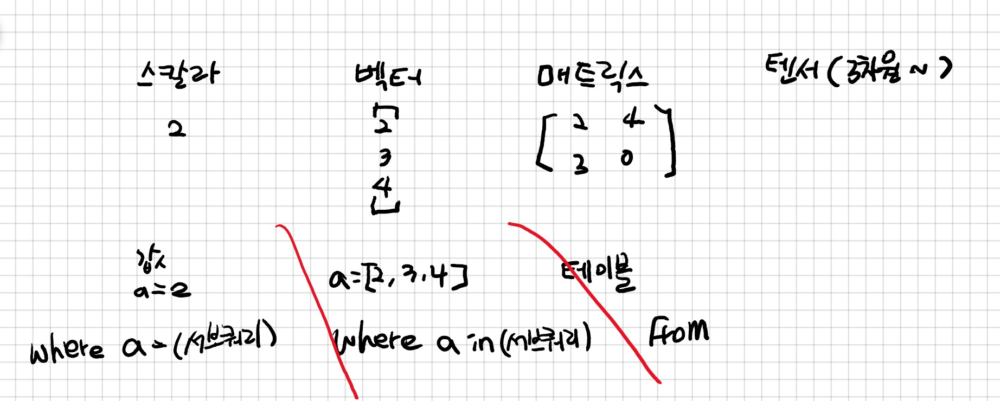

# 10강 강의노트

날짜 : 2019년 09월 09일

강사 : 선미님

---

### Tip.개념설명

- 서브쿼리?
    - 값이 하나가 나오느냐, 여러개가 나오느냐, 진짜 많이 나오는 가에 따라 타입을 구분할 수 있음

## SQL 문제풀이

※ SQL: Challenges (HackerRank) 문제풀이

Q.  보호소에서 중성화한 동물 ( 9월 7일 토요일)

    # 나의 풀이
    SELECT ai.ANIMAL_ID, ai.ANIMAL_TYPE, ai.NAME
    FROM ANIMAL_INS as ai
        INNER JOIN ANIMAL_OUTS as ao ON ai.ANIMAL_ID = ao.ANIMAL_ID
    WHERE ao.SEX_UPON_OUTCOME != ai.SEX_UPON_INTAKE
    
    # 단비님 풀이
    SELECT I.ANIMAL_ID, I.NAME_TYPE, I.NAME
    FROM ANIMAL_INS AS I 
    	INNER JOIN ANIMAL_OUTS AS O ON I.ANIMAL_ID = O.ANIMAL_ID
    WHERE I.SEX_UPON_INTAKE <> O.SEX_UPON_OUTCOM # <> 다름을 의미함
    ORDER BY I.ANIMAL_ID
    
    # 지현님 풀이
    
    # 보람님 풀이
    SELECT I.ANIMAL_ID, I.NAME_TYPE, I.NAME
    FROM ANIMAL_INS AS I 
    	LEFT JOIN ANIMAL_OUTS AS O ON I.ANIMAL_ID = O.ANIMAL_ID
    WHERE 
    
    
    # 한솔님 풀이
    SELECT ANIMAL_ID, ANIMAL_TYPE, NAME
    FROM ANIMAL_INS
    WHERE 
    AND ANIMAL_ID IN
    (SELECT ANIMAL_ID
    ) 

문자열을 다루는 함수들(LEFT( ), RIGHT( ), SUBSTRING_INDEX( ))
- LEFT(컬럼, 숫자) ⇒ LEFT('apple', 3) ⇒ 'app' 
- SUBSTRING_INDEX(컬럼, ' ' ,  인덱스) ⇒ SUBSTRING_INDEX('sol@gmail.com', '@', 1) ⇒ 'sol'

    SELECT i.ANIMAL_ID, i.ANIMAL_TYPE, i.NAME
    FROM ANIMAL_INS i
         INNER JOIN ANIMAL_OUTS ot ON i.ANIMAL_ID = ot.ANIMAL_ID
    WHERE SUBSTRING_INDEX(i.SEX_UPON_INTAKE, ' ', 1) = 'Intact'
    AND SUBSTRING_INDEX(ot.SEX_UPON_OUTCOME, ' ', 1) IN ('Spayed', 'Neutered')
    

Q. 이름에 'el'이 들어가는 동물 찾기 (9월 8일 일요일)

    # 나의 풀이
    SELECT ANIMAL_ID, NAME
    FROM ANIMAL_INS
    WHERE ANIMAL_TYPE = 'Dog'
    AND NAME LIKE "%el%"
    ORDER BY NAME
    
    # 예은님 풀이
    SELECT 
    FROM
    WHERE ANIMAL_TYPE = 'DOG' AND NAME like '%el%'
    AND NAME 
    
    # 혜민님 풀이 - 정규표현식
    SELECT ANIMAL_ID, NAME
    FROM ANIMAL_ING
    WHERE NAME REGEXP 'EL'
    AND ANIMAL_TYPE = 'Dog'
    ORDER BY NAME ASC

LIKE '%{something}%', UPPER( ), LOWER( )

Q. 루사와 엘라 찾기 (9월 8일 일요일)

    # 나의 코드
    SELECT ANIMAL_ID, NAME, SEX_UPON_INTAKE
    FROM ANIMAL_INS
    WHERE NAME IN('Lucy', 'Ella', 'Pickle', 'Rogan', 'Sabrina', 'Mitty')
    GROUP BY ANIMAL_ID

 

### 과제

- [Challenges (HackerRank)](https://www.hackerrank.com/challenges/challenges/problem)

    HackerRank Difficulty: Medium
    Hint. HAVING 절에서 서브쿼리를 잘 활용하세요. 서브쿼리 안에도 또 서브쿼리를 쓸 수 있어요.

- Pandas - inner join 문제 풀기

### 공지

**#데이터야놀자 타임라인**

- **데이터야놀자 관련 질문은 슬랙 #datayanolja2019 에서**
    - 2019-09-16 (월) 자정: 데이터야놀자 발표 [기획안](https://docs.google.com/forms/d/e/1FAIpQLSdmRHum_aOS7YFfY7jDviWqGPy9Ef_VpAExGK9urwn6pVEv2w/viewform) 제출 마감
    - 2019-10-19 (토): 데이터야 놀자

### ※공공데이터 분석 프로젝트

- 2019-09-23 (월): 조별로 선정한 주제와 데이터, 분석 아이디어 발표
- 2019-10-11 (금): 중간발표
(EDA 결과 공유, 추가적인 데이터 수집 또는 분석의 필요성 공유, 피드백 주고받기 등)
- 2019-10-30 (수): 최종발표

### pandas - join (inner)

    #inner join하기
    '''
    SELECT *
    FROM Orders AS o
         INNER JOIN OrderDetails AS od ON o.OrderID = od.OrderID
    '''
    
    order_orderDetails = orders.merge(orderDetails, how='inner', on='OrderID')

    # inner join 후 group by 하기
    '''
    SELECT o.OrderID, COUNT(*)
    FROM Orders AS o
         INNER JOIN OrderDetails AS od ON o.orderID = od.OrderID
    GROUP BY o.OrderID
    '''
    
    products_per_order = order_orderDetails.groupby('OrderID').size()  #.size() 가 카운트 해주는 것
    products_per_order

#series와 datafram?

#양쪽 컬럼이름이 다를때는 on이 아닌,  left_on, right_on, left_index, right_index를 사용