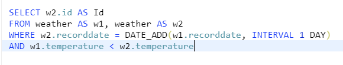
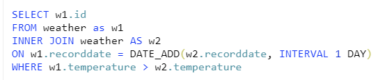

# SQL #

**1. LEETCODE practice**
- [Question1](https://leetcode.com/problems/classes-more-than-5-students/)
- [Question2](https://leetcode.com/problems/big-countries/)
- [Question3](https://leetcode.com/problems/not-boring-movies/)
- [Question4](https://leetcode.com/problems/rising-temperature/submissions/) 
- For Question4 , there are several possible answers as below

**2. Study with MOOC**
- [LINK](https://www.notion.so/MOOC-69a40a62c1f64e8d838ed39bd658d9e1_)
- If apply for financial-aid with self-introduction, can use for free
- when completing with reasonable score, certification will be given 
- check the recommanding list from Sunmi
- Programming for everybody -> good for Python starter

# PYTHON #
## Test ##
- 단정문 Assertion 
    - assert double (1) = = 2
    - Expected/ Actual 비교
    - Expected - 원래 나왔어야 하는 값
    - Actual - 실제 입력한 코드로 계산 했을 때 나온 값 
    - 값이 틀렸을 경우, run했을 때 틀린 것만 확인 가능 
    - example 
    - 
    - 틀린 곳을 지명해줌으로써 다양한 함수를 확인하는데 매우 유용함 
- Pytest
    - pip install pytest 입력을 통해 설치 가능 
    - pytest를 실행한 후 활용
    - 항상 'test_'를 붙여야함!
    - 
    - 정해진 시간마다 자동 확인도 가능함 
    - assert 사용법
        - 1단계 - 단정문 쓰기 (Red)
        - 2단계 - “NameError: name 'double' not defined” 문제 해결 (Red)
        - 3단계 - AssertionError를 재빨리 해결 (Green)
        - 4단계 - 의미 드러내기 (Refactoring)
        - 5단계 - 일반화하기 (Refactoring)
        - 6단계 - 테스트를 추가해 신뢰 확보하기
    - Scores 함수를 활용한 예제
        - total 함수와 test함수 따로 만드러야함
    - 