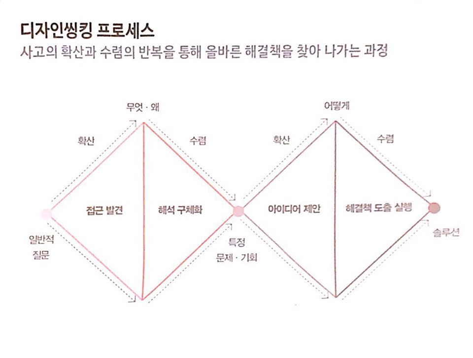

# Design Thinking 2019-09-04
## 디자이너의 사고방식
1.
2.
3. 빠른 실행과 수정

## Design Thinking Process
1. 공감 ** Design Thinking 의 강점
2. 문제정의
3. 아이데이션
4. 프로토타이핑
5. 검증
-> 비선형적, 반복적으로 일어난다

## 올바른 질문을 찾는 것이 중요하다

## 공감 방법
1. 인터뷰하기
2. 관찰하기
3. 직접 체험해보기

## 데이터의 약점을 보완하는 디자인 씽킹
1. 인간 중심 공감
    - 아마존의 인공지능 채용: 남성 편향
2. 개별 요소에 대한 심층적 분석
    - 극단적 사용자 인터뷰 Extreme User Interview (고통 10점짜리 고객)

## 데이터를 통한 사회 혁신
- Civic Hacking
- Data Activism

> ex. 메르스 확산 지도

## 디자인 씽킹의 약점을 보완하는 데이터
1. 정량적, 객관적 분석
2. 인력, 시간 등 리소스 절약

## 디자인 씽킹 관점에서 데이터 분석하기
: 사회문제 → 데이터 → 대표 공감대상 → 이해관계자와 시스템

## 대표 공감대상 설정하기
- 페르소나: 이름, 나이, 직업, 살아온 과정, 가족관계 등 자세하게
- 사람마다 각자 다른 정의를 생각할 수 있다. 팀 구성원끼리 합의하는 내용
- 사용자 관점에서 생각할 수 있다